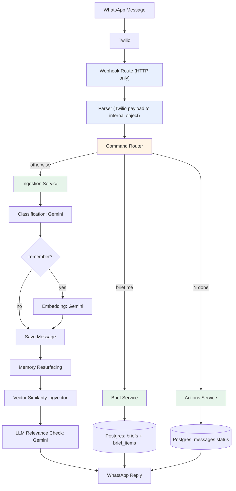
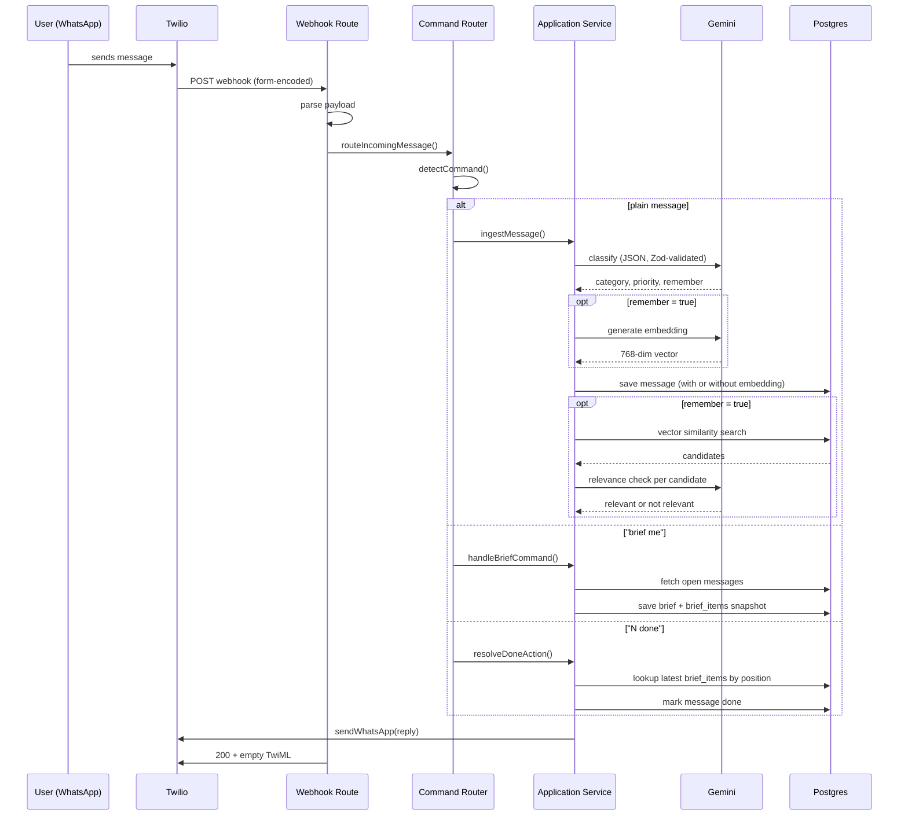
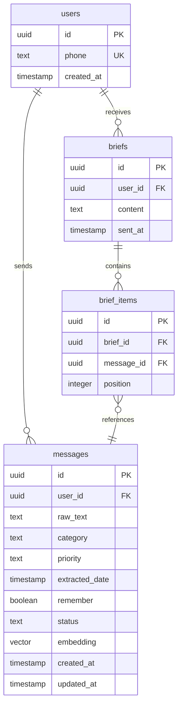
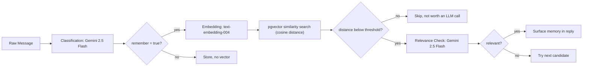

# DailyBrief

**Your AI-powered WhatsApp memory assistant.**

DailyBrief turns WhatsApp — the app you already live in — into an intelligent second brain. Send it tasks, reminders, ideas, and notes as naturally as texting a friend. It classifies them, organizes them into a daily brief, and resurfaces relevant memories exactly when they matter.

---

## Table of Contents

- [Problem](#problem)
- [What DailyBrief Does](#what-dailybrief-does)
- [Example Conversation](#example-conversation)
- [Tech Stack](#tech-stack)
- [Architecture](#architecture)
- [Request Lifecycle](#request-lifecycle)
- [Folder Structure](#folder-structure)
- [Database Schema](#database-schema)
- [AI Pipeline](#ai-pipeline)
- [Design Decisions](#design-decisions)
- [Failure Handling and Graceful Degradation](#failure-handling-and-graceful-degradation)
- [Performance Considerations](#performance-considerations)
- [Limitations](#limitations)
- [Local Setup](#local-setup)
- [Environment Variables](#environment-variables)
- [Running Locally](#running-locally)
- [Screenshots](#screenshots)
- [Demo](#demo)

---

## Problem

People constantly send themselves messages on WhatsApp — reminders, ideas, learning goals, half-formed plans, notes to self. It's the fastest way to capture a thought.

But that's where it ends. Messages pile up, scroll out of view, and get forgotten. There's no structure, no follow-up, and no way to resurface something useful when it's actually relevant again.

DailyBrief captures, organizes, and remembers — so nothing valuable gets lost in the scroll.

---

## What DailyBrief Does

### Message Ingestion
Every incoming WhatsApp message is parsed, classified by Gemini into a structured record, and stored, with a confirmation reply sent back immediately.

Extracted per message:
- **Title** — a clean summary of the message
- **Category** — `TASK` · `REMINDER` · `NOTE` · `IDEA` · `JUNK`
- **Priority** — `HIGH` · `MEDIUM` · `LOW`
- **Date** — if one was mentioned
- **Remember flag** — whether this is worth resurfacing later as long-term context

### Daily Brief
Send `brief me` and DailyBrief compiles every open item into a clean, numbered summary grouped by category, then sends it straight to your chat.

### Done Command
Send `1 done` and the corresponding item is marked complete — resolved against a snapshot of the exact brief you were shown, not a live re-query, so the numbers never drift even if new messages arrive in between.

### Memory Resurfacing
This is the differentiator. Messages worth remembering are embedded and stored as vectors. When a new message comes in, DailyBrief searches for semantically similar past memories, filters out weak matches with an LLM relevance check, and, only when it's genuinely useful, surfaces the connection back to you.

---

## Example Conversation

The emoji markers below (✅, 📝, 💡, 🔥) are part of the actual product output — DailyBrief uses them in its WhatsApp replies as visual category markers, not as README decoration.

```
You:        Need to learn Docker for my project deployment
DailyBrief: ✅ Saved as note.
            📝 Learn Docker for deployment

  (10 days pass)

You:        Deployment is failing because containers are confusing
DailyBrief: ✅ Saved as task.
            📝 Fix deployment containers

            💡 Memory connection
            10 days ago you mentioned:
            "Need to learn Docker for my project deployment"

            This looks related to what you're running into now.

You:        brief me
DailyBrief: DailyBrief

            🔥 Tasks
            1. Fix deployment containers
            2. Prepare presentation tomorrow

            📝 Notes
            3. Learn Docker for deployment

You:        1 done
DailyBrief: ✅ Completed:
            Fix deployment containers
```

---

## Tech Stack

| Layer | Choice |
|---|---|
| Framework | Next.js 16 (App Router) |
| Language | TypeScript |
| Database | PostgreSQL ([Neon](https://neon.tech)) |
| ORM | Drizzle ORM |
| Vector Search | pgvector |
| Classification | Gemini 2.5 Flash |
| Embeddings | Gemini Embedding API (`text-embedding-004`, 768-dim) |
| Messaging | Twilio WhatsApp Sandbox |
| Validation | Zod |

---

## Architecture

DailyBrief follows a strict layered architecture. Every request flows through the same predictable path, with each layer owning exactly one responsibility.



### Layer responsibilities

| Layer | Responsibility | Never does |
|---|---|---|
| **Route** | Parses the HTTP request, delegates, returns TwiML | Business logic, DB access |
| **Parser** | Converts Twilio's form-encoded payload into a typed internal object | Anything beyond shaping data |
| **Command Router** | Detects `brief me` / `N done` / plain message and dispatches | Executing the logic itself |
| **Application Services** (`ingest.ts`, `generate.ts`, `resolve.ts`) | Orchestrates the pipeline, calls domain services and repositories in order | Raw SQL, raw HTTP parsing |
| **Domain Services** (Gemini, Twilio clients) | Wraps external API calls | App-specific business rules |
| **Repositories** | Pure database queries | Any decision-making |

The Router and Application Service layers are deliberately separate. The Router only decides what kind of request this is (`BRIEF` / `DONE` / `NONE`); it has zero knowledge of Gemini, Postgres, or Twilio. Adding a new command, for example `snooze`, never touches ingestion, brief generation, or resurfacing code — it's a new case in `detectCommand()` and one new service.

---

## Request Lifecycle

Every inbound message follows the same lifecycle, regardless of whether it's a command or a message to classify.



The route returns 200 to Twilio independently of whether the reply already succeeded. The WhatsApp reply and the webhook's HTTP response are two separate completions, not one. This distinction is why a slow Gemini call delays the user's reply without corrupting the webhook contract or triggering a duplicate-processing retry from Twilio.

---

## Folder Structure

```
dailybrief/
├── app/
│   └── api/
│       └── webhook/
│           └── whatsapp/
│               └── route.ts          # Twilio webhook, HTTP only
│
├── lib/
│   ├── config/
│   │   └── env.ts                    # Zod-validated environment variables
│   │
│   ├── db/
│   │   ├── schema.ts                 # Drizzle schema (users, messages, briefs, brief_items)
│   │   ├── client.ts                 # Neon + Drizzle instance
│   │   └── migrations/
│   │
│   ├── repositories/                 # Pure DB queries, no business logic
│   │   ├── users.repo.ts
│   │   ├── messages.repo.ts
│   │   └── briefs.repo.ts
│   │
│   └── modules/
│       ├── gemini/                   # Shared Gemini client
│       │
│       ├── classification/
│       │   ├── classify.ts           # Gemini call, structured JSON
│       │   ├── prompts.ts
│       │   └── schema.ts             # Zod schema for classification output
│       │
│       ├── memory/
│       │   ├── embed.ts              # Gemini embedding call
│       │   ├── resurface.ts          # Similarity search + relevance orchestration
│       │   ├── relevance.ts          # LLM relevance check (Zod-validated)
│       │   ├── prompts.ts
│       │   └── schema.ts
│       │
│       ├── brief/
│       │   ├── generate.ts           # Application service, builds + saves + sends brief
│       │   └── formatter.ts          # Pure text formatting, no DB or business logic
│       │
│       ├── commands/
│       │   ├── types.ts              # Command discriminated union
│       │   ├── detect.ts             # Detects BRIEF / DONE / NONE
│       │   └── router.ts             # Dispatches to the right service
│       │
│       ├── actions/
│       │   └── resolve.ts            # Resolves "N done" against a pinned brief snapshot
│       │
│       ├── ingestion/
│       │   └── ingest.ts             # Application service, classify → embed → save → resurface
│       │
│       └── whatsapp/
│           ├── client.ts             # Twilio send wrapper
│           ├── parser.ts             # Twilio payload → WhatsAppIncomingMessage
│           └── types.ts
│
├── scripts/
│   └── seedDemoData.ts               # Seeds realistic historical memories for the demo
│
├── drizzle.config.ts
├── .env
└── package.json
```

---

## Database Schema



`messages` is the core table: every captured thought, its classification, and, when `remember = true`, its embedding vector for similarity search.

`briefs` and `brief_items` exist specifically to make the `N done` command reliable. Rather than recomputing "the user's open items" live every time someone replies with a number, which breaks the moment a new message arrives between the brief and the reply, each brief is saved as a snapshot, with every item's exact position pinned in `brief_items`. `"1 done"` always resolves against what was actually shown, never a live guess.

---

## AI Pipeline

DailyBrief uses Gemini for three distinct jobs, each with its own prompt and its own Zod schema.



1. **Classification** — every message is sent to Gemini with a strict prompt requesting JSON only (`responseMimeType: "application/json"`), then validated with Zod before anything touches the database. A malformed AI response is caught at the boundary, not three layers deep.
2. **Embedding** — only messages classified with `remember: true` are embedded. This keeps the vector index meaningful, avoiding noise from routine items, and avoids unnecessary API calls.
3. **Two-stage memory retrieval** — vector similarity alone isn't trustworthy; two messages can share vocabulary without being meaningfully related. Resurfacing is deliberately two-stage: pgvector narrows candidates fast and cheaply, then a second Gemini call makes the actual judgment on relevance before anything is shown to the user. A distance threshold gates which candidates even reach that second call, keeping latency and cost down.

---

## Design Decisions

**Repository pattern, strictly enforced.** Every DB query lives in `lib/repositories/`. Services never write raw Drizzle queries inline. This made every layer independently testable during development — each repository function was verified against Neon directly before being wired into a service.

**Thin route handlers.** `route.ts` does exactly two things: parse the incoming payload and call the router. All decision-making lives in `lib/modules/`. This kept the HTTP layer trivial to reason about even as the pipeline underneath grew from a single insert to a five-stage AI pipeline.

**Shared Gemini client.** Classification and relevance-checking both go through the same client wrapper, so retries, error handling, and JSON-mode configuration live in one place instead of being duplicated per feature.

**Zod validation on every AI JSON output.** LLMs occasionally return malformed or unexpected shapes. Every Gemini JSON response, classification and relevance alike, is parsed through a Zod schema before it's trusted, so a bad AI response fails loudly and locally instead of corrupting data three steps downstream.

**Why pgvector instead of a dedicated vector database.** A standalone vector database adds a second data store, a second connection to manage, and a second point of failure — for a hackathon timeline, that's schedule risk with no corresponding benefit at this scale. pgvector keeps embeddings in the same transaction boundary as the row they belong to, in the same database already being queried, with no extra infrastructure. At MVP scale (hundreds to low thousands of vectors per user), pgvector's `<=>` operator performs well without an index; a dedicated vector database would only start paying for itself at a scale this project isn't at.

**Why two-stage retrieval, specifically.** Vector similarity alone answers "what shares vocabulary with this?" — it can't answer "would this actually help the user right now?" Two messages about "Docker" can be totally unrelated in intent. Rather than trust distance scores directly, similarity search is used only to produce a small, cheap candidate set (top 3, distance-gated), and a second Gemini call makes the actual relevance judgment. This trades one extra LLM call for the difference between "technically similar" and "actually useful," which is the entire point of a memory feature — a wrong resurfaced memory is worse than no memory at all, since it erodes trust in the feature.

**Why embeddings are gated on `remember = true`.** This is a classification decision made once, at ingestion time, rather than a runtime filter applied later. It keeps the vector index intentionally small and signal-dense, since routine items never get indexed, and it means similarity search never has to filter noise out at query time — the noise was never stored.

**Why brief snapshots (`briefs` + `brief_items`) instead of live numbering.** An earlier design recomputed "the user's open items" fresh every time `brief me` or `N done` ran. This has a subtle but real bug: if a new message arrives between showing a brief and the user replying `"1 done"`, live recomputation can shift what index 1 refers to — the user acts on numbers they saw, but the system resolves against numbers that have since changed. Persisting the exact brief that was shown, with pinned positions, means `"N done"` always resolves against reality as the user actually saw it, not a live guess that happens to usually be right.

---

## Failure Handling and Graceful Degradation

The pipeline has five points where an external call can fail: classification, embedding, similarity search, relevance check, and the WhatsApp send. The guiding principle: a failure in the memory feature should never prevent a message from being saved and acknowledged.

| Stage | Failure Mode | Handling |
|---|---|---|
| Classification | Gemini timeout or malformed JSON | Zod validation catches malformed shape immediately; a hard failure here does block ingestion, since the record has no category to store — this is the one stage where failure is not degraded, by design, because there's no meaningful fallback classification |
| Embedding | Gemini timeout or rate limit | Caught independently — the message still saves with `remember: true` but `embedding: null`, rather than failing the whole request |
| Similarity search | pgvector query error | Caught in the resurfacing orchestrator — resurfacing is skipped for this message, ingestion still completes |
| Relevance check | Malformed JSON, Zod failure, or timeout | Caught per candidate — the loop moves to the next candidate rather than aborting; if all candidates fail, no memory is surfaced, but the message and reply still complete |
| Twilio webhook | Slow response or Twilio retry | Webhook always responds with empty TwiML (`<Response></Response>`) and a 200, regardless of whether internal errors occurred, so Twilio doesn't retry a message that's already been processed |

The result: the worst-case failure mode for any single message is "saved, but without a memory connection," never a lost message, a duplicate send, or a broken reply.

---

## Performance Considerations

A message with `remember: true` makes up to five sequential external calls before replying: classify, embed, similarity search, and up to three relevance checks. This is the main latency cost in the system.

**Current mitigations:**
- A distance threshold gates candidates before they reach the relevance check — most non-matches never trigger an LLM call at all
- Relevance checks short-circuit on the first `relevant: true` result rather than checking all candidates unconditionally

**Future optimizations, not yet implemented:**
- **Parallelize relevance checks** — currently sequential; running them concurrently over the gated candidates would cut worst-case latency roughly three times when multiple candidates pass the distance threshold
- **Cache classification for near-duplicate messages** — not implemented, low priority at current scale
- **Move embedding and resurfacing to a background job** — reply to the user immediately after save, then push the memory connection as a follow-up message once resurfacing completes. This would decouple user-perceived latency from the slowest part of the pipeline entirely, at the cost of the memory connection arriving as a second message instead of inline

---

## Limitations

Honest MVP boundaries, and why each one is where it is:

- **Single WhatsApp user.** Twilio Sandbox supports one active number without a paid WhatsApp Business API upgrade — this was a deliberate scope cut for a four-day build, not a technical ceiling. `users.phone` is already a proper foreign key throughout the schema; multi-user support is a Twilio account change, not a data model change.
- **No authentication or dashboard.** Everything is WhatsApp-native by design — the product bet is that a second surface would add friction, not remove it. A dashboard is a plausible v2, not a missing v1 feature.
- **No scheduled evening brief.** `brief me` is on-demand only. Serverless functions don't hold a persistent process for a cron scheduler; a scheduled brief would need a platform cron job hitting an authenticated endpoint per user, which needs the auth layer above first.
- **Relevance checks run sequentially, not in parallel.** Simpler to reason about and debug during the build; the latency cost is real (see Performance Considerations) and is the first thing to fix post-hackathon.
- **Limited command surface.** Only `brief me` and `N done` exist. Snooze, reschedule, and delete are natural next commands — the router is already built to make adding them a small, isolated change.

---

## Local Setup

### Prerequisites
- Node.js 20+
- A [Neon](https://neon.tech) Postgres project with the `pgvector` extension enabled
- A [Twilio](https://www.twilio.com/whatsapp) account with WhatsApp Sandbox access
- A [Gemini API key](https://ai.google.dev/)
- [ngrok](https://ngrok.com/) (or similar) for exposing your local server to Twilio

### Install

```bash
git clone https://github.com/<your-username>/dailybrief.git
cd dailybrief
npm install
```

### Enable pgvector

In the Neon SQL editor:

```sql
CREATE EXTENSION IF NOT EXISTS vector;
```

### Push the schema

```bash
npx drizzle-kit push
```

---

## Environment Variables

Create a `.env` file in the project root:

```env
DATABASE_URL=postgresql://<user>:<password>@<host>/<db>?sslmode=require

GEMINI_API_KEY=your_gemini_api_key

TWILIO_ACCOUNT_SID=your_twilio_account_sid
TWILIO_AUTH_TOKEN=your_twilio_auth_token
TWILIO_WHATSAPP_NUMBER=whatsapp:+14155238886
```

All variables are validated at startup via `lib/config/env.ts`. The app fails fast with a clear error if any are missing, rather than failing confusingly on the first webhook call.

---

## Running Locally

```bash
# Start the dev server
npm run dev

# In a separate terminal, expose it to the internet
ngrok http 3000
```

Copy the ngrok HTTPS URL and set it as your Twilio Sandbox webhook:

```
https://<your-ngrok-subdomain>.ngrok-free.app/api/webhook/whatsapp
```

Join the Twilio Sandbox from your WhatsApp by sending the join code shown in your Twilio console, then message the Sandbox number directly.

### Seed demo data (optional, recommended before a demo)

```bash
npx tsx scripts/seedDemoData.ts
```

This populates realistic, backdated memories so the resurfacing feature has something to connect to without needing days of organic history.

---

## Screenshots

Add screenshots of real WhatsApp conversations here — ingestion confirmation, a daily brief, and a memory resurfacing moment work best.

``

``

``

---

## Demo

Add a link to your demo video here.

3-minute demo flow:
1. Send a message worth remembering — get an instant, structured confirmation
2. Send `brief me` — see everything open, organized by category
3. Send a related message days later — watch DailyBrief surface the earlier memory unprompted
4. Send `N done` — resolve an item with zero ambiguity, even with new messages in between

---

<p align="center">Built in four days for a hackathon. Turns out remembering things is harder than it sounds.</p>